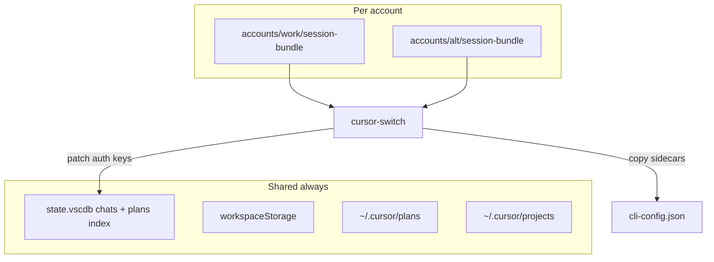

# Architecture

## Problem

Cursor has no built-in multi-account switch. Logging out loses session context and `--user-data-dir` per account duplicates chat history.

## Solution: shared brain + auth swap

One copy of all local Cursor data. Only authentication credentials change on switch.



## Data locations (Linux)

| Path | Role |
|------|------|
| `~/.config/cursor-accounts/shared/config/` | `--user-data-dir` (settings, SQLite, workspaceStorage) |
| `~/.config/cursor-accounts/shared/cursor-home/` | Symlinked as `~/.cursor` (plans, projects, cli-config) |
| `~/.config/cursor-accounts/accounts/<name>/session-bundle/` | Auth snapshots only |

Full Cursor backups (config + home) are stored in the **project repo**:

| Path | Role |
|------|------|
| `~/Projects/cursor-switch/backups/*.zip` | Gitignored; last 7 compressed full backups |

## Chat storage (why sharing works)

Cursor stores messages **locally**:

- **Content**: `shared/config/User/globalStorage/state.vscdb` → table `cursorDiskKV` (`composerData:*`, `bubbleId:*`)
- **Index**: same DB → `ItemTable` → `composer.composerHeaders` (Cursor 3.0+)
- **Workspace link**: `workspaceStorage/<hash>/` keyed by project folder path

None of this is tied to your Cursor login email. Only `cursorAuth/*` keys are account-specific.

References: [cursaves](https://github.com/Callum-Ward/cursaves/blob/main/docs/how-cursor-stores-chats.md), [cursor-chat-transfer](https://github.com/ibrahim317/cursor-chat-transfer).

## Switch sequence

1. Save open folder paths from `storage.json`
2. Quit Cursor; wait for lock file and WAL to clear
3. **Backup** zip of `~/.config/Cursor`, `~/.cursor`, and `~/.config/cursor` → `backups/*.zip`
4. Export outgoing account auth → `session-bundle/`
5. Import incoming account auth (patch copy of DB, integrity check, replace)
6. Update `active` file
7. Launch `cursor --user-data-dir=... --extensions-dir=... -r <folders>`

## Auth keys exported

Dynamic query on `ItemTable`:

- `cursorAuth/%`
- `glass.%`
- `applicationUser` (reactive storage)

Plus whole-file copies: `cli-config.json`, `statsig-cache.json`, and **`~/.config/cursor/`** (terminal `cursor agent` auth).

See [data-locations.md](data-locations.md) for every Cursor folder on disk.

## Mechanisms summary

| Mechanism | Used for |
|-----------|----------|
| **Move once (init)** | Original config → shared |
| **Symlink once (init)** | `~/.cursor` → shared cursor-home |
| **CLI flags (every launch)** | `--user-data-dir`, `--extensions-dir` |
| **SQLite patch (every switch)** | Auth keys only |
| **File copy (every switch)** | Backup zip + sidecar metadata |
| **Nothing** | Chat bodies, plans, settings |

## Code structure

```
src/cursor_switch/
  cli.py          Entry point and argparse
  init_cmd.py     init / init-account
  switch_cmd.py   switch / export-auth
  auth.py         SQLite auth export/import
  cli_config.py   ~/.config/cursor export/import
  backup.py       Zip backups (3 config trees)
  cursor_proc.py  Quit, launch, session folders
  config.py       accounts.toml, active file
  paths.py        Constants
```
